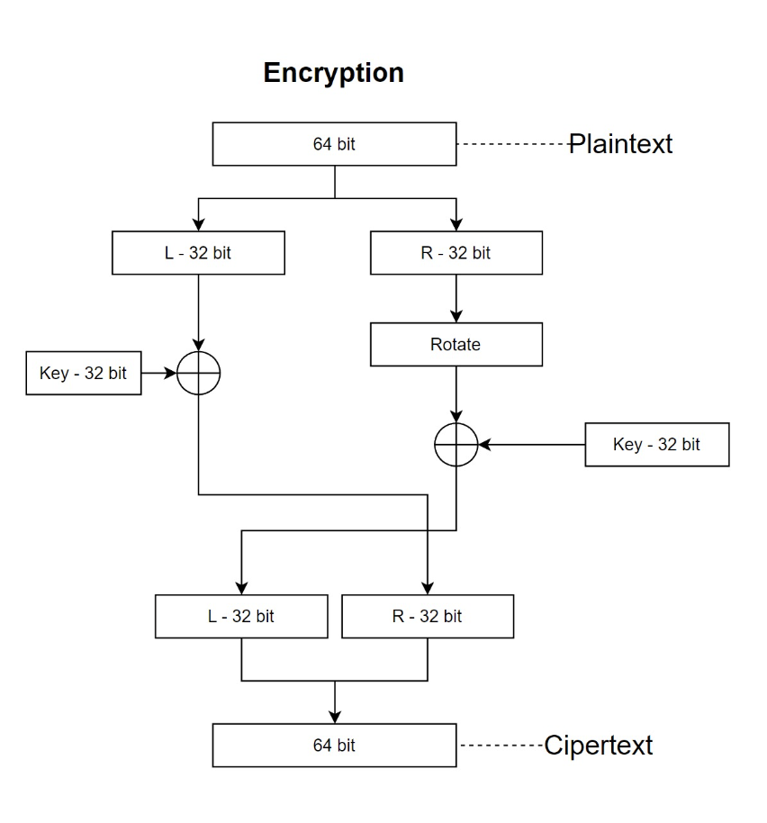
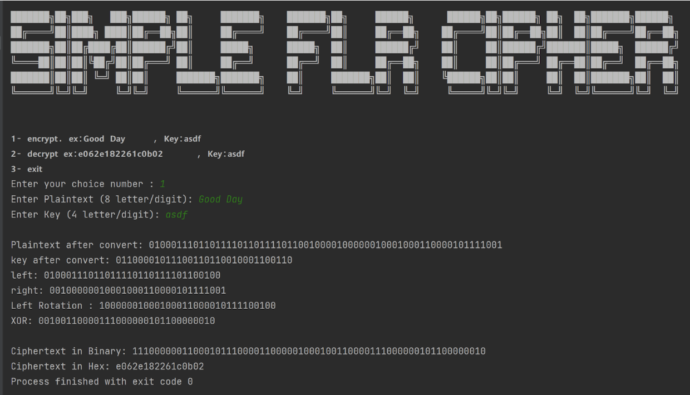

# Simple FLR Cipher

Project for Cryptographic course

## About project

We have defined an algorithm that takes input from a user to either encrypt or decrypt it, our algorithm focus on applying multiple operations such as splitting, XORing, and swapping or Rotation and shifting the original Text bits to provide substitution and permutation techniques on the Plaintext to gain a cipher-text.

## Algorithm Program output :

